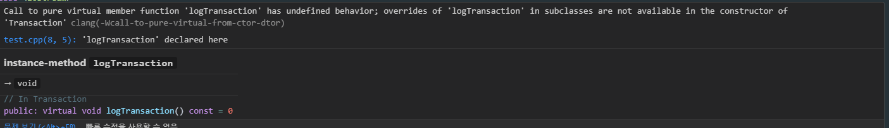

# 항목 9:  객체 생성 및 소멸 과정 중에는 절대로 가상 함수를 호출하지 말자 - 작성자: 한지윤

<aside>
🔎

# 이것만은 잊지말자!

- 생성자 혹은 소멸자 안에서 가상 함수를 호출하지 말자
- 가상함수라해도, 지금 실행중인 생성자나 소멸자에 해당되는 클래스의 파생 클래스 쪽으로 내려가지 않는다.
</aside>

---

# 📚 배경지식: 가상함수란?

- 가상 함수는 **`다형성(polymorphism)`**을 가능하게 해줌
- 즉, **기반 클래스 포인터로 파생 클래스 객체를 가리켜도** 파생 클래스의 함수를 호출할 수 있음

```cpp
class Base {
public:
    virtual void print() const {
        std::cout << "Base\n";
    }
};

class Derived : public Base {
public:
    virtual void print() const override {
        std::cout << "Derived\n";
    }
};
```

```cpp
Base* p = new Derived();
p->print();  // → Derived 출력
```

---

# 📌 생성/소멸 중 가상 함수를 호출하면 어떻게 될까?

```cpp
#include <iostream>
using namespace std;

class Transaction {  // 모든 거래에 대한 기본 클래스
public:
    Transaction();    // 생성자

    virtual void logTransaction() const = 0;  // 타입에 따라 다른 로그 기록 만들기
};

Transaction::Transaction() {
    // ...
    logTransaction();  // ❌ 생성자 안에서 가상 함수 호출 (위험!)
}

// 파생 클래스: 구매 거래
class BuyTransaction : public Transaction {
public:
    virtual void logTransaction() const {
        ...
    }
};

// 파생 클래스: 판매 거래
class SellTransaction : public Transaction {
public:
    virtual void logTransaction() const {
        ...
    }
};
```

위와 같은 코드가 있다고 가정해봅시다…

```cpp
BuyTransaction b;
```

이처럼 호출하게 되면 어떻게 될까?

위와 같이 객체를 생성하면 `Transaction` 생성자에서 `logTransaction()`을 호출하게 되는데, **이 시점에서는 아직 `BuyTransaction`의 생성자가 실행되기 전이므로** `BuyTransaction::logTransaction()`이 아니라

**`Transaction`의 (비어 있는) 버전이 호출됨**

→ 🚨 실제로는 **정의되지 않아 에러** 발생함.

즉, **파생 클래스 객체의 기본 클래스 부분이 생성되는 동안,** 그 객체의 타입은 **기본 클래스** 입니다.

소멸할 때는 어떻게 될까요?
파생 클래스의 소멸자가 일단 호출되고 나면 파생 클래스만의 데이터 멤버는 정의되지 않은 값으로 가정하기 때문에 이제부터 없는 것 처럼 취급하고 진행합니다. 기본 클래스 소멸자에 진입할 당시의 객체는 기본 클래스의 객체가 되며, 모든 C++ 기능들 역시 기본 클래스 객체의 자격으로 처리합니다.
****

- 실제로 해봤을 때
    
    
    
    👉 **순수 가상 함수 `logTransaction`을 생성자에서 호출했기 때문에 생긴 문제**라는 뜻
    
    컴파일러에 따라 다르지만 빌드가 되긴 함
    

---

# 📌 더 최악인 코드

```cpp
#include <iostream>
using namespace std;

class Transaction {
public:
    Transaction() {
        init();  // 비가상 멤버 함수를 호출하고 있는데....
    }

    virtual void logTransaction() const = 0;  // 순수 가상 함수

private:
    void init() {
        // ... 그런데 이 비가상 함수에서 가상 함수를 호출하고 있음!
        logTransaction();  // ⚠️ 위험! 생성자 호출 중이므로 다형성 깨짐
    }
};

```

`logTransaction()` 은 순수 가상 함수인데 이 시점에는 파생 클래스가 아직 생성되기 전이라 
기본 클래스의 `logTransaction()` 이 호출됨
그런데 기본 클래스는 순수 가상 함수만 있고 정의는 없음 → **정의되지 않은 동작(undefined behavior)**

이 코드는 앞선 코드와 달리 **컴파일도 잘되고 링크도 말끔히** 되기때문에 디버깅 지옥에 빠질 수 있음

---

# 📌 해결 방법은?

- `logTransaction()`을 `Transaction` 클래스의 비가상 멤버 함수로 바꾸는 것
- 파생 클래스의 생성자들로 하여금 필요한 로그 정보를 `Transaction`의 생성자로 넘겨야 한다는 규칙을 만듦

```cpp
#include <iostream>
#include <string>
using namespace std;

class Transaction {
public:
    explicit Transaction(const std::string& logInfo);  // 생성자
    void logTransaction(const std::string& logInfo) const;  // 비가상 로그 함수

    // ...
};

Transaction::Transaction(const std::string& logInfo) {
    // ...
    logTransaction(logInfo);  // 이제는 비가상 함수 호출 (안전!)
}

void Transaction::logTransaction(const std::string& logInfo) const {
    cout << "로그 정보: " << logInfo << endl;
}

// 파생 클래스
class BuyTransaction : public Transaction {
public:
    BuyTransaction(/* parameters */)
        : Transaction(createLogString(/* parameters */))  // 로그 정보를 생성자에 전달
    {
        ... 
    }

private:
    static std::string createLogString(/* parameters */) {
        ...
    }
};

```

파생 클래스가 필요한 정보를 준비해서, 부모 클래스 생성자에게 직접 넘겨주는 구조