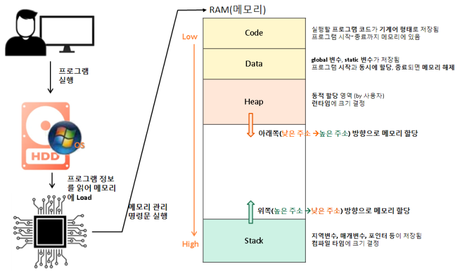

# 항목 11: operator=에서는 자기대입에 대한 처리가 빠지지 않도록 하자 - 작성자: 서영은

<aside>

# 💡이것만은 잊지말자!

- operator=을 구현할 때, 어떤 객체가 그 자신에 대입되는 경우를 제대로 처리하도록 만들자.
원본 객체와 복사대상 객체의 주소를 비교하거나, 코드의 순서 조정, 복사 후 맞바꾸기 기법 등
- 두 개 이상의 객체에 대해 동작하는 함수가 있다면, 이 함수에 넘겨지는 객체들이 사실 같은 객체인 경우에 정확하게 동작하는지 확인하자.
</aside>

---

# 📌 개요

**`자기대입(self assignment)`**이란? 어떤 객체가 **자기 자신**에 대해 대입 연산자를 적용하는 것

```cpp
class Widget { ... };
Widget w;
...
w = w;       // 자기에 대한 대입
```

## 자기대입의 가능성이 있는 예시

```cpp
a[i] = a[j];  // i와 j가 같은 값을 갖게 되면 자기대입문이 됨
*px = *py;    // px와 py가 가리키는 대상이 같으면 자기대입이 됨
```

**자기 대입이 생기는 이유?** ⇒ 여러 곳에서 하나의 객체를 참조하는 상태, 즉 **`중복참조(aliasing)`** 때문!

같은 타입으로 만들어진 객체 여러 개를 참조자나 포인터로 가리키고 동작하는 코드를 작성할 때, 중복참조 가능성을 고려하는 것이 바람직!

```cpp
class Base { ... };
class Derived: public Base { ... };
void doSomething(const Base& rb, Derived* pd);  // rb와 *pd는 원래 같은 객체였을 수도 있음
```

**TIP**💡같은 클래스 계통에서 만들어진 객체라면, 파생 클래스 타입의 객체를 참조하거나 가리키는 용도로 기본 클래스의 참조자나 포인터를 사용하면 됨

# 📌 객체와 자기대입

객체를 만들때 자기대입에 안전하게 작동하도록 대입 연산자를 조심하자

```cpp
class Bitmap { ... };
class Widget {
	...
private:
	Bitmap *pb;     // 힙에 할당한 객체를 가리키는 포인터
};
```

힙(Heap) 메모리 영역이란? 동적 할당 영역으로 런타임에 크기가 결정됨.

- 메모리 구조
    
    
    
    - Code 영역 (Text 영역):
    - Data 영역: 전역(global) 변수와 정적(static) 변수, 상수 저장. 정적 메모리.
    - Heap 영역: 사용자가 메모리 할당을 운영체제에 요청(동적 할당). 동적 메모리.
    - Stack 영역: 지역 변수, 매개 변수 저장.
    - **출처 및 참고**
        
        https://blog.naver.com/dorergiverny/223316504781
        
        https://dsnight.tistory.com/50
        

## 자기 참조의 가능성이 있는 코드

```cpp
Widget&
Widget::operator=(const Widget& rhs)  // 안전하지 않게 구현된 operator=
{
	delete pb;                 // 현재의 비트맵 사용을 중지
	pb = new Bitmap(*rhs.pb);  // 이제 rhs의 비트맵을 사용하도록 만듦
	return *this;
}
```

대입되는 대상(*this)과 rhs가 **같은 객체일 가능성**이 있음.

⇒ pb와 rhs가 같은 객체일 가능성이 있어서 delete 연산자가 rhs의 객체까지 적용되어버림.

그러면 Widget이 가리키고 있던 객체가 삭제되어버림.

## ✅ 해결 방법 1. 일치성 검사 (indentity test)

```cpp
Widget& Widget::operator=(const Widget& rhs)
{
	if(this == &rhs) return *this; // 객체가 같은지 검사해서 자기대입이면 아무것도 안함
	
	delete pb;                 
	pb = new Bitmap(*rhs.pb);
	return *this;
}
```

**문제점**

- 예외 안전성이 떨어짐
    - new Bitmap에서 예외가 발생하면 Widget은 삭제된 Bitmap을 가리키는 포인터를 갖게 됨.
    - 예외: 동적 할당에 필요한 메모리 부족이나 Bitmap 클래스 복사 생성자에서 예외 발생 등
- 코드가 커지고, 처리 흐름에 분기를 만들게 되므로 실행 시간 속력이 줄어들 수 있음.
- CPU 명령어 선행인출(instruction prefetch), 캐시, 파이프라이닝 등의 효과도 떨어질 수 있음.
    - CPU 명령어 선행인출이란? 실제로 필요하기 전에 미리 명령어를 가져오는 것.
        
        명령어 인출은 CPU 파이프라인의 첫번째 단계로, 프로그램 카운터가 가리키는 메모리 주소에서 다음에 실행할 명령어를 가져오는 과정. 현재 실행이 필요한 명령어를 가져옴
        
        
        
        - **출처 및 참고**
            
            https://coding-ok.tistory.com/42
            
            https://en.wikipedia.org/wiki/Cache_prefetching
            

## ✅ 해결 방법 2. 코드의 순서 조정

```cpp
Widget& Widget::operator=(const Widget& rhs)
{
	Bitmap *pOrig = pb;          // 원래의 pb를 어딘가에 저장
	pb = new Bitmap(*rhs.pb);    // pb가 *pb의 사본을 가리키게 함
	delete pOrig;                // 원래의 pb를 삭제
	
	return *this;
}
```

원본 비트맵을 복사 → 복사한 사본을 포인터가 가리키게 함 → 원본을 삭제

new Bitmap 부분에서 예외가 발생하더라도 pb는 변경되지 않은 상태가 유지됨.

가장 효율적인 방법이라고는 할 수 없겠지만, 동작에는 아무 문제가 없음.

## ✅ 해결 방법 3. 복사 후 맞바꾸기 (copy and swap)

```cpp
class Widget {
	...
	void swap(Widget& rhs);  // *this의 데이터 및 rhs의 데이터를 맞바꿈 (항목 29에 자세히)
	...
};

Widget& Widget::operator=(const Widget& rhs)
{
	Widget temp(rhs);  // rhs의 데이터에 대해 사본 생성 (복사 생성)
	swap(temp);        // *this의 데이터를 그 사본의 것과 맞바꿈
	return *this;
}
```

### C++ 특징을 활용해서 다르게 구현

1. 클래스의 복사 대입 연산자는 인자를 값으로 취하도록 선언하는 것이 가능
2. 값에 의한 전달을 수행하면 전달된 대상의 사본이 생긴다는 점 (항목 20에 자세히)

```cpp
Widget& Widget::operator=(Widget rhs) // rhs는 넘어온 원래 객체의 사본 (값에 의한 전달)
{
	swap(rhs);     // *this의 데이터를 이 사본의 데이터와 맞바꿈
	return *this;
}
```

코드의 명확성이 떨어지지만 컴파일러가 더 효율적인 코드를 생성할 수 있는 여지가 만들어짐.

- 왜? ⇒ 객체를 복사하는 코드가 함수 본문에서 매개변수의 생성자로 옮겨졌기 때문.

- 값에 의한 전달이란? (간단 설명)
    
    CS 질문으로 많이 나오는 call by value / call by reference
    
    - 값에 의한 전달(pass by value = call by value)
        - 값을 복사해서 그 값 자체를 전달
    - 참조에 의한 전달 (pass by reference = call by reference)
        - 값이 들어있는 주소 값을 전달