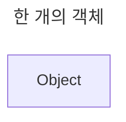
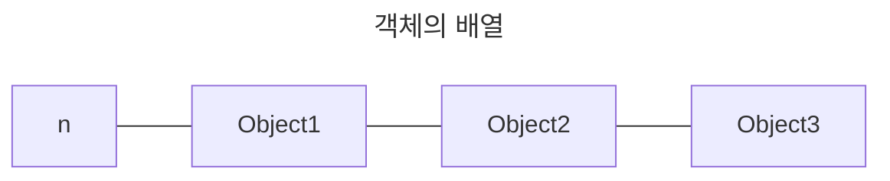

# 항목 16: new 및 delete를 사용할 때는 형태를 반드시 맞추자 - 작성자: 고형주

<aside>
🔎

# 이것만은 잊지말자!

- new 표현식에 []를 썼으면, 대응되는 delete 표현식에도 []를 써야 합니다. 마찬가지로 new 표현식에 []를 안 썼으면, 대응되는 delete 표현식에도 []를 쓰지 말아야 합니다.
</aside>

## 핵심 용어

<aside>

## 메모리 관리 용어

### **operator new / operator delete**

- **의미**: 실제 메모리 할당/해제를 담당하는 함수
- **구별**: `new` 연산자와 `operator new` 함수는 다름
- **역할**: 로우레벨 메모리 관리

### **new 연산자의 내부 동작**

1. **메모리 할당**: `operator new` 함수 호출
2. **생성자 호출**: 할당된 메모리에서 객체 생성

### **delete 연산자의 내부 동작**

1. **소멸자 호출**: 객체 파괴
2. **메모리 해제**: `operator delete` 함수 호출
</aside>

<aside>

---

# 📌 new 연산자를 사용한 표현식

</aside>

## delete를 사용한 삭제 시도

```cpp
std::string *stringArray = new std::string[100];

...

delete stringArray;  // [문제 발생] 1개만 소멸, 99개는 소멸자 호출 안 됨
```

`stringArray`는 100개의 `string` 객체를 가리키고 있다. 그러나 `delete`로 인해서는 삭제가 하나만 된다. 

`delete`는 `stringArray`가 단일 객체라고 가정하고 소멸자를 딱 1번만 호출하기 때문이다. 나머지 99개 `string` 객체들은 소멸자가 호출되지 않아 메모리 누수가 발생한다.

## new 연산자 사용 시, 내부 동작

`new` 연산자를 사용해서 표현식을 꾸미게 되면(`new`로 어떤 객체를 동적 할당하면), 두 가지 내부 동작이 진행된다.

1. **메모리 할당**(이때, `operator new`라는 이름의 함수가 쓰인다)
2. 할당된 메모리에 대해 **한 개 이상의 생성자가 호출**

## delete 표현식 사용 시, 내부 동작

`delete` 표현식을 쓸 경우에는(`delete` 연산자를 사용할 때에는), 두 가지 내부 동작이 진행된다.

1. 기존에 할당된 메모리에 대해 **한 개 이상의 소멸자가 호출**
2. **메모리 해제**(이때, `operator delete`라는 이름의 함수가 쓰인다.)

여기서 `delete` 연산자가 적용되는 객체는 소멸자가 호출되는 횟수가 된다.

## ⚠️ delete 연산자는 포인터가 가리키는 것이 단일 객체인지 배열인지 자동으로 알 수 없다.

삭제되는 포인터는 객체 하나만 가리킨다. `new`로 힙에 만들어진 단일 객체의 메모리 배치구조(layout)는 객체 배열에 대한 메모리 배치구조와 다르기 때문이다. 특히 배열을 위해 만들어지는 힙 메모리에는 대개 배열 원소의 개수가 함께 들어가기 때문에, `delete` 연산자는 소멸자가 몇 번 호출될지 쉽게 알 수 있다. 그러나 **단일 객체용 힙 메모리에는 이런 정보가 없다.** 

## 배치 구조 예시

배치 구조가 다르다는 말의 예시는 다음과 같다. 이는 예시일 뿐 대다수의 경우에는 이렇게 구현하지 않는다. n은 배열의 크기이다. 





```
단일 객체: [Object]
객체 배열: [크기 정보][Obj1][Obj2][Obj3]...

delete는 크기 정보가 없다고 가정하고 1번만 호출
delete[]는 크기 정보를 보고 100번 호출
```

---

<aside>

# 📌 형태를 똑같이 맞추기

</aside>

## ⭕ 대괄호를 사용하여 형태 맞추기

어떤 포인터에 대해 `delete`를 적용할 때, `delete` 연산자를 사용해 ‘배열 크기 정보’가 있다고 알려줄지 여부는 개발자에게 달려 있다. `delete` 뒤에 대괄호 쌍([])을 뒤에 붙여주면 `delete`는 ‘포인터가 배열을 가리키고 있다’라고 가정하게 된다. 만약 대괄호를 붙여주지 않으면 해당 객체를 단일 객체라고 간주하게 된다.

```cpp
std::string *stringPtr1 = new std::string;

std::string *stringPtr2 = new std::string[100];

...

// 객체 한 개를 삭제
delete stringPtr1;

// 객체의 배열을 삭제
delete [] stringPtr2;
```

위와 같이 사용하면 정상적으로 객체가 삭제된다.

## ❌ 형태를 잘못 사용했을 때

### 1️⃣ 단일 객체에 delete[] 사용

```cpp
std::string *stringPtr1 = new std::string

delete [] stringPtr1;  // 단일 객체에 delete[] 사용
// 문제: 임의의 메모리를 배열 크기로 해석
// → 엄청나게 많은 소멸자 호출 시도 → 크래시 가능
```

`delete [] stringPtr1;` 를 사용하게 되면, `delete`는 앞쪽의 메모리 몇 바이트를 읽고 이것을 배열 크기라고 인식한다. 그리고 배열 크기에 해당하는 횟수만큼 소멸자를 호출하기 시작한다. **해당 메모리가 실제로는 배열이 아닌데 배열로 해석하려 하면서 문제가 발생한다.**

### 2️⃣ 배열에 delete 사용

```cpp
std::string *stringPtr2 = new std::string[100];

delete stringPtr2;     // 배열에 delete 사용  
// 문제: 99개 객체의 소멸자가 호출되지 않음
// → 메모리 누수 발생
```

`delete stringPtr2;` 를 대신 사용하게 되면, `int` 등의 기본 제공 타입이라고 해도 대괄호가 없기 때문에 “소멸자 호출 횟수가 너무 적어서” 미정의 동작(메모리 누수)이 나타난다. 소멸자가 없음에도 그렇게 동작한다. 

## 🚨 클래스 설계 시 주의점 정리

```cpp
class DataManager {
    std::string* data;
public:
    // 생성자1: 단일 객체
    DataManager() : data(new std::string) {}
    
    // 생성자2: 배열 
    DataManager(int size) : data(new std::string[size]) {}
    
    // 소멸자 선택: 어떤 delete를 써야 할까?
    ~DataManager() { 
		    // 둘 다 쓸 수는 없다!
        delete data;     // 생성자1용
        // delete[] data; // 생성자2용
    }
};
```

한 클래스에서는 생성자를 사용할 때, 일관된 할당 방식을 사용해야 한다.

## ✅ 결론

- `new` 표현식에 `[]`를 썼으면, 여기에 대응되는 `delete` 표현식에도 `[]`를 써야한다.
- `new` 표현식에 `[]`을 안 썼으면, 대응되는 `delete` 표현식에도 `[]`을 쓰면 안된다.

특히 동적 할당된 메모리에 대한 포인터를 멤버 데이터로 갖고 있는 클래스를 만드는 중이며, 이 클래스에서 제공하는 생성자도 여러 개일 경우에 이 부분을 잘 기억해야 한다. 

포인터 멤버를 초기화하는 부분인 생성자에서 `new` 형태를 똑같이 맞출 수 밖에 없기 때문이다. 이렇게 하지 않으면 소멸자에서 어떤 형태의 `delete`를 써야 할지 알 수 없다. 

---

<aside>

# 📌 typedef

</aside>

## typedef에도 동일 규칙 적용

해당 규칙은 `new`와 `delete` 뿐만이 아니라 `typedef`에도 가치가 있다. 

`typedef`로 정의된 어떤 타입의 객체(배열)를 메모리에 생성하려고 `new`를 썼을 때 나중에 어떤 형태의 `delete`를 적어줘야 하는 가에 대한 언급을 달아주는 책임은 해당 `typedef` 타입의 작성자가 져야 한다고 의미를 줄 수 있기 때문이다. 

예를 들어 `typedef` 타입이 다음과 같이 되어 있다고 가정할 수 있다.

```cpp
// 주소는 네 줄로 되어 있고, 각각은 string이다.
// 배열 typedef
typedef std::string AddressLines[4];

// "new AddressLines"는 "new string[4]"이기 때문에 string*을 반환한다는 점을 잊으면 안된다.
// "new AddressLines"라고 쓰지만 실제로는 배열을 만드는 것
std::string *pal = new AddressLines;  // = new std::string[4]

// delete도 배열(array) 형태가 되어야 제대로 소멸된다.
// 따라서 반드시 delete[]를 사용해야 한다.
delete[] pal;  // 맞음
delete pal;    // 틀림 - 3개 객체 누수
```

## **✅ 배열 타입을 `typedef` 타입으로 만들지 않는 것이 좋다**

**문제가 생기는 것을 방지하고 싶다면, 배열 타입을 `typedef` 타입으로 만들지 않는 것이 좋다.** 요즘 표준 C++ 라이브러리에는 `string`이나 `vector` 같은 좋은 클래스 템플릿이 있기 때문에, 동적 할당 배열이 필요해질 경우가 거의 없기 때문이다. 예를 들어 위의 예제에서는 `AddressLines`는 `string`의 `vector`로 정의(`vector<string>` 타입)해도 된다. 

```cpp
// 위험한 방식
typedef std::string AddressLines[4];
AddressLines* addresses = new AddressLines[10];  // 혼란스러움
delete[] addresses;

// 안전한 방식  
typedef std::vector<std::string> AddressLines;
AddressLines addresses(4);  // 자동으로 관리됨, delete 불필요
```