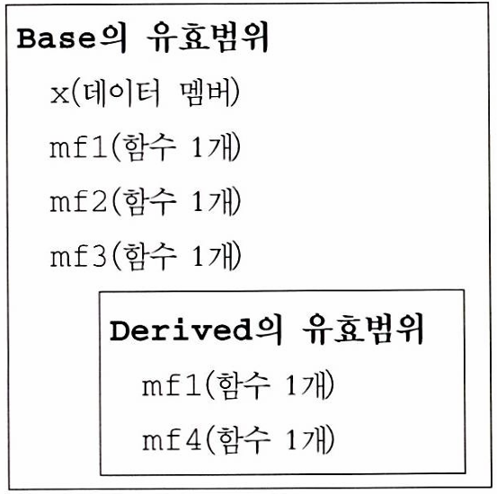
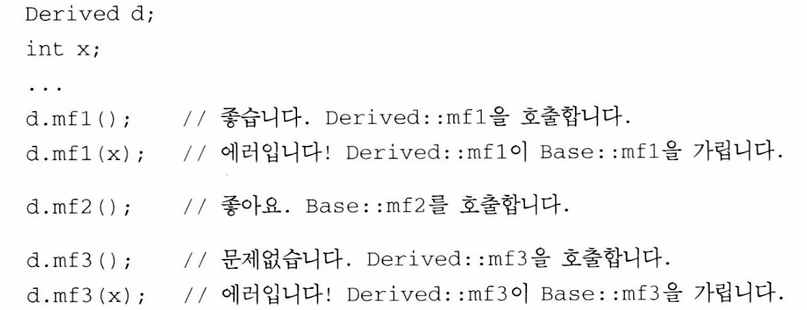
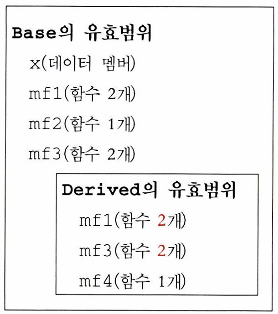
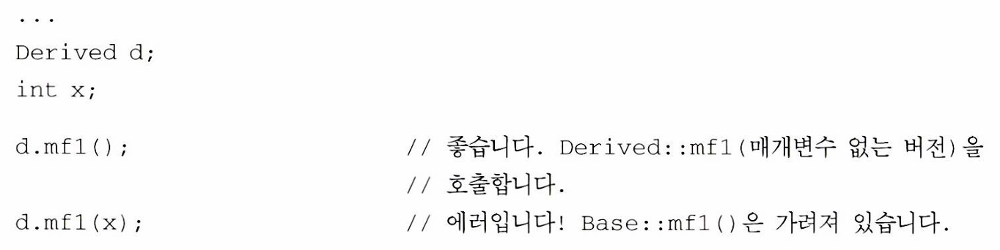

# 항목33: 상속된 이름을 숨기는 일은 피하자 - 작성자: 신동욱

### 결론

- 파생 클래스의 이름은 기본 클래스의 이름을 가린다. public 상속에서는 이런 이름 가림 현상은 바람직하지 않다.
- 가려진 이름을 다시 볼 수 있게 하는 방법으로, `using` 선언 혹은 **전달 함수**를 쓸 수 있다

---

### 들어가기...

- 이번 항목에서는 유효범위(scope)에 대해 이야기 할거임
- 컴파일러가 어떻게 “이름”을 인식하는지에 대한 기본적인 이해를 갖는 시간이 되는거임

```cpp
int x; //전역 변수

void someFunc()
{
	double x; //지역 변수
	
	std::cin >> x; //입력을 받아, 지역 변수 x에 새 값을 읽어 넣는다
}
```


- someFunc의 x가 전역 x의 이름을 가린다

---

### 기본 클래스와 파생 클래스

```cpp
class Base {
private:
	int x;

public:
	virtual void mf1() = 0; //순수 가상 함수
	virtual void mf2();		//가상 함수
	void mf3();
	
};

class Derived : public Base {
public:
	virtual void mf1();
	void mf4();
};
```



- 파생 클래스는 기본 클래스에 속해 있는 것(멤버 함수, typedef 혹은 데이터 멤버)을 파생 클래스 멤버 함수 안에서 참조할 수 있다

---

### 이름 가리기 규칙

- 부모 클래스의 멤버 함수가 여러 개 오버로드되어 있어도,
-  자식 클래스에서 같은 이름의 함수를 하나만 새로 정의하면
-  부모의 그 이름을 가진 모든 함수가 가려짐(시그니처 상관 없음)

```cpp
class Base {
private:
	int x;

public:
	virtual void mf1() = 0; //순수 가상 함수
	virtual void mf1(int); //mf1 오버로드
	virtual void mf2();		//가상 함수
	void mf3();
	void mf3(double); //mf3 오버로드
};

class Derived : public Base {
public:
	virtual void mf1();
	void mf3();
};
```
- Derived 클래스에서 mf1()을 **오버라이드**함  
    -> 이 순간 부모 클래스에 정의되어 있는 mf1 이름을 가진 함수들은 전부 가려져서 접근할 수 없음
    
    

<details>
<summary> 💡오버로드와 오버라이드 </summary>

### 오버로딩(Overloading)

- 정의 : 같은 이름의 함수를 매개변수의 타입·개수가 다르게 여러 개 정의하는 것
- 조건:
    - 함수 이름 같음
    - 매개변수 리스트(타입/개수/순서)가 다름
    - 반환 타입만 다른 건 **불가능**
    
    ```cpp
    class Math {
    public:
        int add(int a, int b);           // add(int,int)
        double add(double a, double b);  // add(double,double)
    };
    
    ```
    

### 오버라이딩(Overriding)

- 정의 : 상속 관계에서, 부모 클래스의 가상 함수(virtual)를 자식 클래스가 **같은 시그니처로 재정의**하는 것
- 조건:
    - 부모 함수가 `virtual` 이어야 함
    - 함수 이름 + 매개변수 리스트(시그니처)가 동일해야 함
    
    ```cpp
    class Base {
    public:
        virtual void print();
    };
    
    class Derived : public Base {
    public:
        void print() override; // Base의 print()를 재정의
    };
    
    ```
</details>

---

### 가려진 이름 쓰고 싶다면?

```cpp
class Base {
private:
	int x;

public:
	virtual void mf1() = 0; //순수 가상 함수
	virtual void mf1(int); //mf1 오버로드
	virtual void mf2();		//가상 함수
	void mf3();
	void mf3(double); //mf3 오버로드
};

class Derived : public Base {
public:
	using Base::mf1; //Base에 있는 멤버 함수 mf1과 mf3라는 이름을
	using Base::mf3; // 가진 함수들을 Derived 유효범위에서 볼 수 있도록
	virtual void mf1();
	void mf4();
};
```



- using 키워드를 사용해 그 이름을 가진 모든 함수에 접근하게 할 수 있다
- 다만, 특정 함수만 접근하는 것은 안되고, 모든 함수가 오픈된다

---

### 특정 함수만 오픈하고 싶다면?

- private 상속하는 경우에서 생각하자
- 왜? 애초에 public 상속을 했으면 다 오픈하겠다는거 아님?
- 특정 함수만 오픈하고 싶다는게 private 상속과 논리적으로 일맥상통하잖슴
- 쨌든 그래서 특정 함수만 오픈하기 위해 전달 함수를 만들어 놓으면 된다

```cpp
class Base {
public:
	virtual void mf1() = 0;
	virtual void mf1(int);
	...
};

class Derived : private Base {
public:
	virtual void mf1()
	{ Base::mf1(); }
	...
};
```

- 이렇게 하면 됩니당



---

### 다시 결론

- Derived의 이름은 Base의 이름을 가린다. → C++이 그렇게 정했음
- public 상속에서는 이런 이름 가림 현상은 바람직하지 않다. → 외부에서도 접근 가능하게 해야 하잖슴
- 가려진 이름을 다시 볼 수 있게 하는 방법으로, `using` 선언 혹은 **전달 함수**를 쓸 수 있다