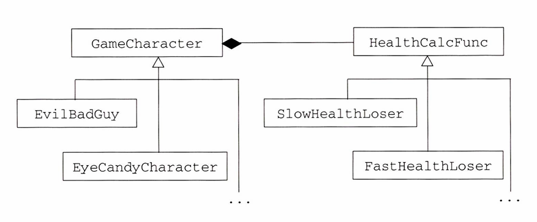

# 항목 35: 가상 함수 대신 쓸 것들도 생각해 두는 자세를 시시때때로 길러 두자 - 작성자: 서영은

<aside>

# 🔎 이것만은 잊지말자!

- 가상 함수 대신에 NVI 관용구(템플릿 메서드 패턴) 및 전략 패턴을 사용할 수 있다.
- 객체에 필요한 기능을 멤버 하수로부터 클래스 외부의 비멤버 함수로 옮기면, 그 비멤버 함수는 그 클래스의 public 멤버가 아닌 것들을 접근할 수 없다는 단점이 생긴다.
- tr1::function 객체는 일반화된 함수 포인터처럼 동작한다. 이 객체는 주어진 대상 시그너처와 호환되는 모든 함수호출성 개체를 지원한다.
</aside>

---

# 가상함수

```cpp
class GameCharacter {
public:
	virtual int healthValue() const; // 캐릭터의 체력치를 반환하는 함수
																	 // 파생 클래스가 재정의 가능
};
```

# 📌 비가상 인터페이스 관용구를 통한 템플릿 메서드 패턴

```cpp
class GameCharacter {
public:
	int healthValue() const // 파생 클래스가 재정의 불가
	{
		...                            // 사전 동작 수행
		int retVal = doHealthValue();  // 실제 동작 수행
		...                            // 사후 동작 수행
		return retVal;
	}

private:
	virtual int doHealthValue() const // 파생 클래스가 재정의 가능
	{
		...   // 캐릭터 체력치 계산을 위한 기본 알고리즘 구현
	}
};
```

## **비가상 함수 인터페이스(non-virtual interface: NVI) 관용구**

- public 비가상 멤버함수를 통해 private 가상 함수를 간접적으로 호출하는 방법
- 템플릿 메서드(Template Method)라 불리는 고전 디자인 패턴을 C++ 식으로 구현한 것
- 저자는 관용구에 쓰이는 비가상 함수(예: healthValue)를 가상 함수의 `랩퍼(wrapper)`라고 말함

## ✅ NVI 관용구의 장점

가상 함수가 호출되기 전에 어떤 상태를 구성하고 가상 함수가 호출된 후에 그 상태를 없애는 작업이 랩퍼를 통해 공간적으로 보장됨.

**예시**

사전 동작: 뮤텍스 잠금 걸기, 로그 정보 생성, 클래스의 불변속성과 함수의 사전조건 만족 검증 작업 등

사후 동작: 뮤텍스 잠금 풀기, 클래스 불변속성 재검증 작업 등

만일, 사용자 쪽에서 가상 함수를 직접 호출하도록 했다면 사전 •사후 동작을 끼워 넣을 방법이 없음.

### 🤔 private 가상 함수를 파생 클래스에서 재정의하는건 문제 없나요?

가상 함수를 `재정의` 하는 일 ⇒ 어떤 동작을 `어떻게` 구현할 것인가를 지정하는 것

가상 함수를 `호출`하는 일 ⇒ 그 동작이 수행될 `시점`을 지정하는 것

NVI 관용구에서는 **파생 클래스의 가상 함수 재정의를 허용**함

- 어떤 기능을 `어떻게` 구현할지를 조정하는 권한 → `파생 클래스`
- 함수를 `언제` 호출할지를 결정하는 권한 → `기본 클래스`

### ⚠️ 주의할 점

예시 코드의 멤버 함수 본문이 클래스 정의 안에 들어가 있음 ⇒ 암시적 인라인 함수 선언

진행 상황을 잘 보이게 하려고 한 것이라서 인라인 함수와는 관계가 없으니 써도 된다고 생각하지는 말기.

**NVI 관용구에서 가상 함수는 항상 private 멤버일 필요는 없음.**

파생 클래스에서 재정의되는 가상 함수가 기본 클래스의 대응 함수(같은 이름의 가상 함수)를 호출할 것을 예상하고 설계된 것도 있는데, 이런 경우에 적법한 함수 호출이 되려면 protected 멤버여야 함.

항목 27의 Window::onResize() 예제 참고.

간혹 가상 함수가 public 멤버여야 할 때도 있음 (다형성 기본 클래스의 소멸자)

근데 여기까지 오면 사실 NVI 관용구를 적용하는 의미가 없음.

# 📌 함수 포인터로 구현한 전략 패턴

NVI 관용구는 public 가상 함수를 대신할 수 있지만, 클래스 설계 관점에서 보면 눈속임이나 다름없음.

어쨌든 체력치를 계산하는 데 가상 함수를 사용하기 때문.

더 극적인 설계로 캐릭터의 체력치를 계산하는 작업은 캐릭터의 타입과 별개로 놓아보자.

즉, 체력치 계산이 캐릭터의 일부일 필요가 없다는 말.

## 전략(Strategy) 패턴의 응용 예시

- 전략 패턴에 대해 참고
  https://blog.naver.com/travel1210/222510008168
  https://victorydntmd.tistory.com/292

```cpp
class GameCharacter; // 전방 선언

// 체력치 계산에 대한 기본 알고리즘을 구현한 함수
int defaultHealthCalc(const GameCharacter& gc);

class GameCharacter {
public:
	typedef int (*HealthCalcFunc) (const GameCharacter&);

	explicit GameCharacter(HealthCalcFunc hcf = defaultHealthCalc)
	: healthFunc(hcf)
	{}

	int helathValue() const
	{ return healthFunc(*this); }
	...
private:
	HealthCalcFunc healthFunc;
};
```

각 캐릭터의 생성자에 체력치 계산용 함수의 포인터를 넘기고, 이 함수를 호출해서 실제 계산을 수행.

- `explicit란?` 암시적 변환을 하지 못하게 막는 키워드
  **참고** https://modoocode.com/253

```cpp
class EvilBadGuy: public GameCharacter {
public:
 explicit EvilBadGuy(HealthCalcFunc hcf = defaultHealthCalc)
 : GameCharacter(hcf)
 { ... }
};

int loseHealthQuickly(const GameCharacter&); // 다른 동작 원리로 구현된
int loseHealthSlowly(const GameCharacter&);  // 체력치 계산 함수들

EvilBadGuy ebgl(loseHealthQuickly);          // 같은 타입인데도
EvilBadGuy ebg2(loseHealthSlowly);           // 체력치 변화가 다르게 나오는 캐릭터들
```

## ✅ 장점

- 같은 캐릭터 타입으로부터 만들어진 객체(인스턴스)들이 체력치 계산 함수를 각각 다르게 가질 수 있음.
- 게임이 실행되는 도중에 특정 캐릭터에 대한 체력치 계산 함수를 바꿀 수 있음.

예를 들어, GameCharacter 클래스에서 setHealthCalculator라는 멤버 함수를 제공하고 있다면, 이를 통해 현재 쓰이는 체력치 계산 함수의 교체가 가능해짐.

## ⚠️ 문제점

체력치 계산 함수가 GameCharacter 클래스 계통의 멤버 함수가 아님.

체력치가 계산되는 대상 **객체의 비공개 데이터는 이 함수로 접근할 수 없다**는 의미.

체력 계산을 위해 public이 아닌 정보를 써야 할 경우, 문제 발생.

이 문제는 멤버 함수를 비멤버 비프렌드 함수나 다른 클래스의 비프렌드 멤버 함수를 통해 대체하려면 언제든 생기는 고민거리임.

public 영역에 없는 부분을 비멤버 함수도 접근할 수 있게 하려면 캡슐화를 약화시키는 방법밖에 없다는 것이 일반적.

예: 비멤버 함수를 프렌드로 선언, 세부 구현사항에 대한 접근자 함수를 public 멤버로 제공 등.

함수 포인터를 통해 얻는 이점들이 클래스의 캡슐화를 떨어뜨리면서 얻는 불이익을 채워줄지는 스스로 판단.

# 📌 tr1::function으로 구현한 전략 패턴

체력치 계산을 함수처럼 동작하는 함수 객체를 쓰면 안 되나?

반환 값도 int로 바꿀 수 있는 임의의 타입이면 충분하지 않나?

tr1::function 타입의 객체를 써서 함수 포인터를 대신하게 만들면 위의 불편한 점이 사라짐.

**함수호출성 개체(callable entity; 함수 포인터, 함수 객체 혹은 멤버 함수 포인터)**를 가질 수 있고, 이들 개체는 주어진 시점에서 예상되는 시그너처와 호환되는 시그너처를 갖고 있음. (항목 54 참고)

```cpp
class GameCharacter;

int defaultHealthCalc (const GameCharacter& gc);

class GameCharacter {
public:
	// HealthCalcFunc는 함수호출성 개체로서, GameCharacter와 호환되는
	// 어떤 것이든 넘겨받아서 호출될 수 있으며 int와 호환되는 모든 타입의 객체를 반환.
	// 자세한 내용은 아래.
	typedef std::trl::function<int (const GameCharacter&)> HealthCalcFunc;
	explicit GameCharacter(HealthCalcFunc hcf = defaultHealthCalc)
	: healthFunc(hcf)
	{}

	int healthValue() const
	{ return healthFunc(*this); }
	...

private:
	HealthCalcFunc healthFunc;
};
```

HealthCalcFunc는 tr1::function 템플릿을 인스턴스화한 것에 대한 typedef 타입임.

즉, 이 타입은 일반화된 함수 포인터 타입처럼 동작한다는 뜻.

```cpp
typedef std::trl::function<int (const GameCharacter&)> HealthCalcFunc;
```

`의미` : const GameCharacter에 대한 참조자를 받고 int를 반환하는 함수

이렇게 정의된 tr1::function 타입으로 만들어진 객체는 앞으로 대상 시그너처와 호환되는 함수호출성 개체를 어떤 것도 가질 수 있음.

**`호환된다(compatible)`**

함수호출성 개체의 매개변수 타입이 const GameCharacter& 이거나 const GameCharacter& 로 암시적 변환이 가능한 타입이며, 반환 타입도 암시적으로 int로 변환될 수 있다는 의미.

### 함수 포인터를 썼을 때와 달라진 점

tr1::function 객체, 즉 더 일반화된 함수 포인터를 물게됨.

사용자 쪽에선 체력치 계산 함수를 지정하는 데 융통성을 얻음.

```cpp
short calcHealth(const GameCharacter&); // 체력치 계산 함수. 반환 타입이 int가 아님!

struct HealthCalculator {       // 체력치 계산용 함수 객체를 만들기 위함
	int operator()(const GameCharacter&) const
	{ ... }
};

class GameLevel {
public:
	float health(const GameCharacter&) const; // 체력치 계산에 쓰일 멤버 함수.
	...
};

class EvilBadGuy: public GameCharacter {
	...
};

class EyeCandyCharacter: public GameCharacter { // 또 다른 캐릭터 타입.
	...                                           // 생성자는 EvilBadGuy와 동일하다고 가정.
};

EvilBadGuy ebgl(calcHealth); // 체력치 계산을 위한 함수를 사용

EyeCandyCharacter eccl(HealthCalculator()); // 체력치 계산을 위한 함수 개체를 사용

GameLevel currentLevel;
...

EvilBadGuy ebg2( // 체력치 계산을 위한 멤버 함수를 사용하는 캐릭터 (설명은 아래)
	std::trl::bind(&GameLevel::health,
									currentLevel,
									_1);
};
```

ebg2의 체력치를 계산하기 위해 GameLevel 클래스의 health 멤버 함수를 써야 한다는 의미.

GameLevel::health 함수는 매개변수 하나만 받는 것으로 선언되어 있지만, 실제로는 두개 받음.

GameLevel 객체 하나(⇒ this 포인터가 가리키는 것)를 암시적으로 받아들이기 때문.

하지만 GameCharacter 객체에 쓰는 체력치 계산 함수가 받는 매개변수는 체력치가 계산되는 GameCharacter 객체 하나뿐임.

만일, ebg2의 체력치 계산에 GameLevel::health 함수를 쓰려하면, 어떻게든 매개변수 두개를 받는 함수를 매개변수 하나만 받는 함수로 고쳐야함.

지금 예제 코드에서는 ebg2의 체력치 계산에 쓸 GameLevel 객체로서 currentLevel만을 쓸 생각이므로, GameLevel::health 함수가 호출될 때마다 currentLevel이 사용되도록 묶어준 것.

즉, ebg2의 체력치 계산 함수는 항상 currentLevel만을 GameLevel 객체로 쓴다고 지정한 것.

- **tr1::bind 란?? (c++11부터는 std::bind)**
  https://blog.naver.com/kails_/220165913717
  https://cplusplus.com/reference/functional/bind/?kw=bind

`_1` 은? ebg2에 대해 currentLevel과 묶인 GameLevel::health 함수를 호출할 때 넘기는 첫 번째 자리의 매개변수를 뜻함. 자유 매개변수 리스트에 대한 자리채움자.

- **더 정확히는 tr1::placeholders::\_1 (C++ 11부터는 std::placeholders::\_1)**
  https://en.cppreference.com/w/cpp/utility/functional/placeholders.html

아무튼, 함수 포인터 대신에 tr1::function을 사용함으로써, 사용자가 게임 캐릭터의 체력치를 계산할 때 시그너처가 호환되는 함수호출성 개체가 어떤 것도 원하는 대로 구사할 수 있도록 융통성을 가지게 됨.

# 📌 고전적인 전략 패턴

더 전통적인 방법으로 구현한 전략 패턴.

**체력치 계산 함수를 나타내는 클래스 계통을 따로 만들고, 실제 체력치 계산 함수는 이 클래스 계통의 가상 멤버 함수로 만드는 것.**



GameCharacter가 상속 계통의 최상위 클래스.

EvilBadGuy, EyeCandyCharacter는 파생 클래스.

HealthCalcFunc는 SlowHealthLoser, FastHealthLoser 등을 파생 클래스로 가진 최상위 클래스.

GameCharacter 타입을 따르는 모든 객체는 HealthCalcFunc 타입의 객체에 대한 포인터를 포함함.

```cpp
class GameCharacter;  // 전방 선언

class HealthCalcFunc {
public:
	...
	virtual int calc(const GameCharacter& gc) const
	{ ... }
	...
};

HealthCalcFunc defaultHealthCalc;

class GameCharacter {
public:
	explicit GameCharacter(HealthCalcFunc *phcf = &defaultHealthCalc)
	: pHealthCalc(phcf)
 {}

 int healthValue() const
{ return pHealthCalc->calc(*this); }
...
private:
	HealthCalcFunc *pHealthCalc;
};
```

표준적인 전략 패턴 구현 방법에 친숙한 경우 빨리 이해할 수 있다는 장점.

HealthCalcFunc 클래스 계통에 파생 클래스를 추가함으로써 기존의 체력치 계산 알고리즘을 조정/개조할 수 있는 가능성을 열어 놓음.

# 📌 요약

가상 함수를 대신하는 방법들

- **비가상 인터페이스 관용구(NVI 관용구) 사용**
  - 공개되지 않은 가상 함수를 비가상 public 멤버 함수로 감싸서 호출
  - 템플릿 메서드 패턴의 한 형태
- **가상 함수를 함수 포인터 데이터 멤버로 대체**
  - 전략 패턴의 핵심만을 보여주는 형태
- **가상 함수를 tr1::function 데이터 멤버로 대체**
  - 호환되는 시그너처를 가진 함수호출성 개체를 사용할 수 있음.
  - 전략 패턴의 한 형태
- 한쪽 클래스 계통에 속해 있는 가상 함수를 **다른 쪽 계통에 속해 있는 가상 함수로 대체**
  - 전략 패턴의 전통적인 구현 형태

위에서 알려준 네 가지가 가상 함수 대신 쓸 수 있는 방법의 전부는 아님.
