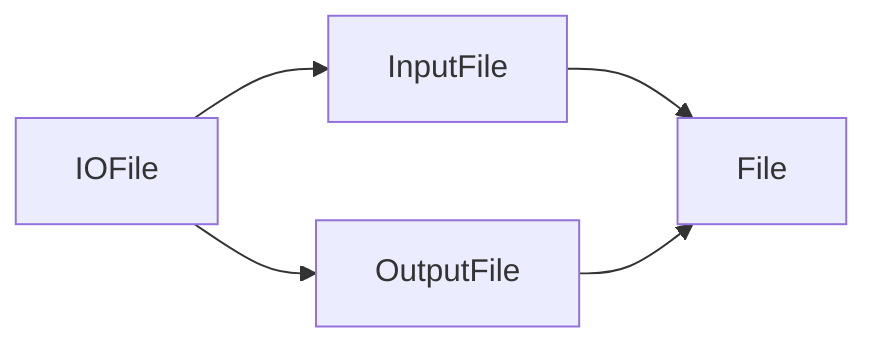
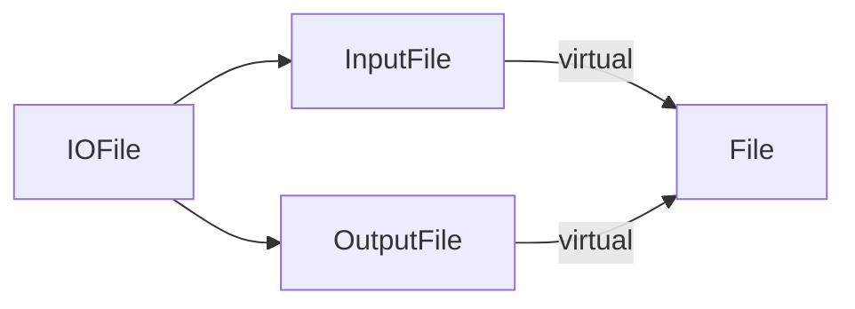
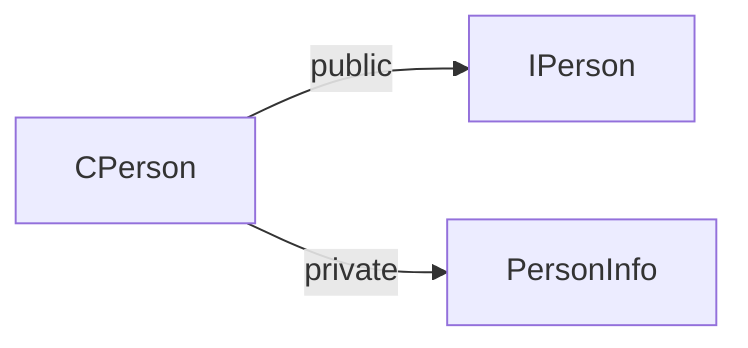

# 항목 40: 다중 상속은 심사숙고해서 사용하자 - 작성자: 고형주

<aside>
🔎

# 이것만은 잊지 말자!

- 다중 상속은 단일 상속보다 확실히 복잡합니다. 새로운 모호성 문제를 일으킬 뿐만 아니라 가상 상속이 필요해질 수도 있습니다.
- 가상 상속을 쓰면 크기 비용, 속도 비용이 늘어나며, 초기화 및 대입 연산의 복잡도가 커집니다. 따라서 가상 기본 클래스에는 데이터를 두지 않는 것이 현실적으로 가장 실용적입니다.
- 다중 상속을 적법하게 쓸 수 있는 경우가 있습니다. 여러 시나리오 중 하나는, 인터페이스 클래스로부터 public 상속을 시킴과 동시에 구현을 돕는 클래스로부터 private 상속을 시키는 것입니다.
</aside>

# 배경 지식

<aside>

## 상속의 종류

**public 상속 (is-a 관계)**

- "B는 A의 일종이다" (B is-a A)
- 기본 클래스가 할 수 있는 모든 것을 파생 클래스도 할 수 있어야 함
- 예: `class Circle: public Shape`

**private 상속 (is-implemented-in-terms-of 관계)**

- "B는 A를 사용하여 구현된다"
- 구현 상속이지 인터페이스 상속이 아님
- 외부에서는 상속 관계가 보이지 않음
- 가상 함수를 재정의해야 할 때 객체 합성 대신 사용

**객체 합성 (has-a 또는 is-implemented-in-terms-of)**

- 한 클래스가 다른 클래스를 멤버로 포함
- 일반적으로 private 상속보다 선호됨
- 단, 가상 함수 재정의가 필요하면 private 상속 사용
</aside>

<aside>

## 인터페이스 클래스

**특징:**

- 순수 가상 함수만 가진 추상 클래스
- 데이터 멤버를 갖지 않음
- 구현이 아닌 인터페이스만 정의
- 자바/C#의 Interface와 유사

**목적:**

- 여러 구현체가 공통으로 따라야 할 규약 정의
- 구현으로부터 인터페이스 분리
</aside>

<aside>

## 팩토리 함수 패턴

**역할:**

- 구체 클래스의 인스턴스를 생성하여 반환
- 사용자는 구체 클래스를 직접 알 필요 없음
- 포인터나 스마트 포인터로 반환

```cpp
*// 팩토리 함수 예*
std::shared_ptr<Interface> createObject(*/*params*/*) {
    return std::shared_ptr<Interface>(new ConcreteClass(*/*params*/*));
}
```

</aside>

---

<aside>

# 📌 다중 상속에 대한 견해

</aside>

다중 상속(Multiple Inheritance: MI)에 대해서는 두 가지 극단적인 견해가 있다.

1. 단일 상속(Single Inheritance: SI)이 좋다면 다중 상속은 더 좋을 것이 분명하다
2. 단일 상속은 좋지만 다중 상속은 골칫거리이다

---

<aside>

# 📌 문제 1: 모호성(Ambiguity)

</aside>

다중 상속은 둘 이상의 기본 클래스로부터 똑같은 이름(함수, typedef 등)을 물려받을 가능성이 생긴다. 이로 인해 다중 상속에도 모호성이 생긴다. 

```cpp
// 라이브러리로부터 여러분이 가져올 수 있는 클래스
class BorrowableItem {
public:
	// 라이브러리로부터 체크아웃
	void checkOut();
	...
};

class ElectronicGadget {
private:
	// 자체 테스트를 실시, 성공 여부를 반환
	bool checkOut() const;
	...
};

// 다중 상속 사용
// [중요] 여기서 MI가 된다 (MP3 플레이어를 위해 몇몇 라이브러리로부터 기능을 가져옵니다.)
class MP3Player:
	public BorrowableItem,
	public ElectronicGadget
// 지금 이 클래스가 어떻게 정의됐는가는 별로 중요하지 않다
{ ... };
	
MP3Player mp;

// [모호성 발생!] 어느 checkOut인가?
mp.checkOut();
```

## 중요한 점

두 `checkOut` 함수 중에서 파생 클래스가 접근할 수 있는 함수가 명확한데도(`BorrowableItem`의 것은 `public` 멤버, `ElectronicGadget`의 것은 `private` 멤버) 모호성이 발생한다.

## 이유

C++ 컴파일러는 어떤 함수가 접근 가능한 함수인 지 알아보기 전에 다음 순서로 판단하기 때문이다.

1. 먼저 최적 일치 함수(best-match) 찾기
2. 그 다음 접근 가능성 점검

지금의 경우 두 `checkOut` 함수의 일치도가 같아서 최적 일치 함수가 결정되지 않는다. 따라서 `ElectronicGadget::checkOut`의 접근 가능성을 점검하는 단계까지 가지도 못한다.

## 해결 방법

다음과 같이 모호성을 해소하기 위해 **호출할 기본 클래스의 함수를 직접 지정**한다.

```cpp
mp.BorrowableItem::checkOut();
```

---

<aside>

# 📌 문제 2: 죽음의 MI 마름모꼴 (Deadly MI Diamond)

</aside>

다중 상속은 상위 단계의 기본 클래스를 여러 개 갖는 클래스 계통에서 "죽음의 MI 마름모꼴"이라는 구조를 만들 수 있다.

```cpp
class File { ... };

class InputFile: public File { ... };

class OutputFile: public File { ... };

class IOFile: public InputFile,
							public OutputFile
{ ... };
```



## 문제 상황

`File` 클래스 안에 `fileName`이라는 데이터 멤버가 있다면, `IOFile` 클래스에는 이 필드가 몇 개 있어야 할까?

### 두 가지 관점

1. 기본 클래스로부터 사본을 하나씩 물려받으니 `fileName`이 2개
2. 논리적으로 파일 이름은 하나만 있어야 하니 `fileName`이 1개

### **C++의 선택**

둘 다 지원하지만, 기본적으로는 **데이터 멤버를 중복 생성**하는 쪽이다.

---

<aside>

# 📌 문제 2의 해결책: 가상 상속 (Virtual Inheritance)

</aside>

데이터 멤버의 중복 생성을 원하지 않는다면, 해당 클래스를 **가상 기본 클래스(virtual base class)**로 만든다.

가상 기본 클래스로 삼을 클래스에 직접 연결된 파생 클래스에서 가상 상속(virtual inheritance)을 사용하게 만드는 것이다. 

```cpp
class File { ... };

class InputFile: virtual public File { ... };

class OutputFile: virtual public File { ... };

class IOFile: public InputFile,
							public OutputFile
{ ... };
```



## 표준 라이브러리의 예

C++ 표준 라이브러리도 이런 모양의 MI 상속 계통을 사용한다:

- `basic_ios`, `basic_istream`, `basic_ostream`, `basic_iostream`
    
    ```mermaid
    graph LR
        basic_istream[basic_istream] -->|virtual| basic_ios[basic_ios]
        basic_ostream[basic_ostream] -->|virtual| basic_ios
        basic_iostream[basic_iostream] --> basic_istream
        basic_iostream --> basic_ostream
    
    ```
    

---

<aside>

# 📌 가상 상속의 비용

</aside>

**정확성 관점에서는 public 상속이 항상 가상 상속이어야 맞다. 하지만 가상 상속에는 비용이 따른다.**

## 크기와 속도 비용

1. **크기:** 가상 상속을 사용하는 객체는 비가상 상속 객체보다 일반적으로 크기가 더 크다
2. **속도:** 가상 기본 클래스의 데이터 멤버 접근이 비가상 기본 클래스보다 느리다

## 초기화의 복잡성

가상 기본 클래스의 초기화 규칙:

1. 가상 기본 클래스로부터 파생된 클래스는 가상 기본 클래스와의 거리에 상관없이 가상 기본 클래스의 존재를 염두에 두고 있어야 한다
2. 새로운 파생 클래스를 추가할 때도 가상 기본 클래스의 초기화를 떠맡아야 한다

## 가상 상속 사용 조언

1. **굳이 쓸 필요가 없으면 가상 기본 클래스를 사용하지 않는다.** 비가상 상속을 기본으로 삼자.
2. **가상 기본 클래스를 정말 써야 한다면, 가상 기본 클래스에는 데이터를 넣지 않는다.** 이는 자바와 닷넷의 Interface 개념과 유사하다.

---

<aside>

# 📌 실용적인 다중 상속 예제

</aside>

## 다중 상속을 의미있게 사용하는 예

**인터페이스의 public 상속 + 구현의 private 상속**

## 시나리오: 사람 모형화

C++ 인터페이스 클래스로 사람을 모형화한다.

**IPerson 인터페이스**

```cpp
class IPerson {
public:
	virtual ~IPerson();
	
	virtual std::string name() const = 0;
	virtual std::string birthDate() const = 0;
};
```

`IPerson`을 사용하려면 포인터나 참조자를 통해 프로그래밍해야 한다. 추상 클래스는 인스턴스로 만들 수 없기 때문이다.

### IPerson 객체 생성 방법

조작이 가능한 `IPerson` 객체(즉, `IPerson`의 동작 원리를 그대로 쓸 수 있는 객체)를 생성하기 위해, `IPerson`의 사용자는 팩토리 함수를 사용해서 `IPerson`의 구체 파생 클래스를 인스턴스로 만든다.

```cpp
// 팩토리 함수: 유일한 데이터베이스 ID로부터 IPerson 객체 생성
std::tr1::shared_ptr<IPerson> makePerson(DatabaseID personIdentifier);

// 사용자로부터 데이터베이스 ID를 얻어내는 함수
DatabaseID askUserForDatabaseID();

// 사용 예
DatabaseID id(askUserForDatabaseID());
std::tr1::shared_ptr<IPerson> pp(makePerson(id));
// IPerson 인터페이스를 지원하는 객체를 하나 만들고 pp로 가리키게 합니다.
// 이후에는 *pp의 조작을 위해 IPerson의 멤버 함수를 사용합니다.
```

### makePerson 함수의 구현 고민

그런데 `makePerson` 함수는 어떻게 그 함수가 반환할 포인터로 가리킬 객체를 새로 만들 수 있는 것일까?

잘은 모르지만, 분명히 `makePerson` 함수가 인스턴스로 만들 수 있는 구체 클래스가 `IPerson`으로부터 파생되어 있어야 할 것이다.

**이 클래스의 이름을 CPerson이라고 가정하자.**

구체 클래스가 원래 그렇듯이 `CPerson`은 `IPerson`으로부터 물려받은 순수 가상 함수에 대한 구현을 제공해야 한다. 물려받은 것은 껍데기뿐이니 어쨌든 바닥부터 구현할 수도 있지만, 남들이 만들었거나 자기가 만들어 둔 코드를 이리 맞추고 저리 맞추는 것이 더 나을지도 모른다.

**예:** 예전에 준비해 둔 데이터베이스 전담 클래스인 `PersonInfo`가 현재 `CPerson`에 필요한 핵심 기능을 다 갖고 있다고 가정하자.

## 구현 클래스: PersonInfo

예전에 만들어둔 데이터베이스 전담 클래스로, `CPerson` 구현에 필요한 기능을 갖고 있다.

```cpp
class PersonInfo {
public:
	explicit PersonInfo(DatabaseID pid);
	virtual ~PersonInfo();
	
	virtual const char * theName() const;
	virtual const char * theBirthDate() const;
	...
private:

	// 시작 구분자 (기본: "[")
	virtual const char * valueDelimOpen() const;
	
	// 끝 구분자 (기본: "]")
	virtual const char * valueDelimClose() const;
	...
};
```

멤버 함수의 반환 타입이 요즘처럼 `string` 객체가 아니라 `const char*`를 반환하고 있다. 예전에 만들어 놓은 클래스의 느낌이 나지만 반환 결과가 이상하지는 않다는 느낌이 든다.

### PersonInfo의 특징

`PersonInfo` 클래스로 데이터베이스 필드를 다양한 서식으로 출력할 수 있는 기능을 사용할 수 있다. 이 기능을 쓰면 각 필드 값의 시작과 끝을 임의의 문자열로 구분하여 출력할 수 있다.

**기본 동작:**

- 출력용 필드 값의 시작과 끝에 붙는 구분자가 대괄호(`[]`)로 미리 정해져 있다
- 필드 값이 `"Ring-tailed Lemur"`라면 다음과 같이 서식화된다.
    
    ```cpp
    [Ring-tailed Lemur]
    ```
    

**커스터마이징:**`PersonInfo`의 사용자가 전부 대괄호를 구분자로 쓰고 싶어하지는 않을 것이므로, 사용자가 원하는 시작 구분자와 끝 구분자를 파생 클래스에서 지정할 수 있도록 `valueDelimOpen` 함수와 `valueDelimClose` 함수를 가상 함수로 마련해둔다.

그리고 `PersonInfo` 클래스의 다른 멤버 함수들은 이 가상 함수를 통해 자신들이 사용하는 필드 값에 적절한 구분자를 붙이도록 구현되는 것이다.

**PersonInfo::theName 구현 예시**

`PersonInfo::theName` 함수를 예로 들면, 다음과 같은 코드가 나올 수 있다.

```cpp
const char * PersonInfo::valueDelimOpen() const
{
	// 기본적으로 지정된 시작 구분자
	return "[";
}

const char * PersonInfo::valueDelimClose() const
{
	// 기본적으로 지정된 끝 구분자
	return "]";
}

const char * PersonInfo::theName() const
{
	// 반환 값을 위한 버퍼를 예약
	// 이 버퍼는 정적 메모리이기 때문에, 자동으로 모두 0으로 초기화
	static char value[MAX_Formatted_Field_Value_Length];
	
	// 시작 구분자를 value에 씁니다.
	std::strcpy(value, valueDelimOpen());
	
	// value에 들어 있는 문자열에 이 객체의 name 필드를 덧붙임
	// (버퍼 오버런이 일어나지 않도록 주의)
	
	// 끝 구분자를 value에 추가
	std::strcat(value, valueDelimClose());
	return value;
}
```

구시대적인 스타일로 설계된 `PersonInfo::theName` 함수를 써야 하는지 이해가 되지 않을 수도 있다. 일단 그 부분은 논외로 하자.

**핵심:** `theName`은 `valueDelimOpen`을 호출해서 시작 구분자를 만들고, name 값 자체를 만든 다음, `valueDelimClose`를 호출한다.

이때 `valueDelimOpen`과 `valueDelimClose`는 **가상 함수**이기 때문에, `theName`이 반환하는 결과는 `PersonInfo`에만 좌우되는 것이 아니라 `PersonInfo`로부터 파생된 클래스에도 좌우된다.

## 문제 발생: IPerson과 PersonInfo의 차이

`CPerson`을 구현하는 입장에서 볼 때 이점은 반가운 소식이다. 이런 내용이 적힌 `IPerson`의 문서를 읽다 보면 `name`과 `birthDate` 함수가 반환하는 값에는 **장식, 즉 구분자가 붙으면 안 된다**는 사실을 알게 되기 때문이다.

**요구사항:**

- 어떤 사람(사람 객체)의 이름이 `Homer`라면,
    
    그 사람의 `name` 함수는 `"[Homer]"`가 아닌 `"Homer"`를 반환해야 한다
    

**현재 상황:**

- `PersonInfo::theName()`은 `"[Homer]"`를 반환

**해결책:**

- `valueDelimOpen()`과 `valueDelimClose()`를 재정의하여 빈 문자열 `""`을 반환하게 만들면 된다

## CPerson과 PersonInfo의 관계

`CPerson`과 `PersonInfo` 사이를 잇는 관계 고리는 “`PersonInfo` 클래스는 `CPerson`을 구현하기 편하게 만들어주는 함수를 어쩌다가 갖고 있다는 것”이 전부이다.

앞 항목에서 배운 용어로 표현하면 **is-implemented-in-terms-of 관계**이다.

### is-implemented-in-terms-of 관계를 표현하는 두 가지 방법

1. **객체 합성** (일반적으로 선호)
    
    ```cpp
       class CPerson {
           PersonInfo info;  *// 멤버로 포함*
       };
    ```
    

1. **private 상속** (가상 함수를 재정의해야 할 때)
    
    ```cpp
       class CPerson: private PersonInfo {
           *// PersonInfo의 가상 함수 재정의 가능*
       };
    ```
    

대부분의 경우에 선호하는 방법은 객체 합성이지만, 가상 함수를 꼭 재정의해야 한다면 private 상속을 써야 한다.

### 지금의 경우는?

`CPerson` 클래스에서는 `valueDelimOpen` 및 `valueDelimClose`를 **반드시 재정의**해야 한다.

→ 단순한 객체 합성으로는 목적 달성이 불가능

→ **`CPerson`이 `PersonInfo`로부터 private 상속을 받도록 만드는 것이 가장 평이한 해결책**

비용이 들지만 객체 합성과 (public) 상속을 조합하는 방법으로도 `PersonInfo`의 가상 함수를 효과적으로 재정의할 수 있다. 여기서는 private 상속을 이용해보자.

### CPerson의 두 가지 요구사항

한편, `CPerson` 클래스는 `IPerson` 인터페이스도 함께 구현하지 않으면 안 되기 때문에, 이를 위해서는 **public 상속**이 필요하다.

이를 통해 다중 상속을 의미있게 사용하는 예를 만들 수 있다.

- 인터페이스의 public 상속 (`IPerson`)
- 구현의 private 상속 (`PersonInfo`)

## 최종 구현: CPerson 클래스

```cpp
// 이 클래스가 나타나는 것은 용도에 따라 구현될 인터페이스
class IPerson {
public:
	virtual ~IPerson();
	
	virtual std::string name() const = 0;
	virtual std::string birthDate() const = 0;
};
class DatabaseID { ... };

// 이 클래스에는 IPerson 인터페이스를 구현하는데 유용한 함수가 들어있음
class PersonInfo {
public:
	explicit PersonInfo(DatabaseID pid);
	virtual ~PersonInfo();
	
	virtual const char * theName() const;
	virtual const char * theBirthDate() const;

	virtual const char * valueDelimOpen() const;
	virtual const char * valueDelimClose() const;
	...
};

// **MI 사용**
class CPerson: public IPerson, private PersonInfo {

public: 
	explicit CPerson(DatabaseID pid): PersonInfo(pid) {}
	
	// IPerson 클래스의 순수 가상 함수에 대해 파생 클래스의 구현 제공
	virtual std::string name() const
	{ return PersonInfo::theName(); }
	
	virtual std::string birthDate() const
	{ return PersonInfo::theBirthDate(); }

// 구분자와 관련된 가상 함수들도 상속되므로, 이 함수들에 대한 재정의 버전 구현
private:
	const char * valueDelimOpen() const {return "";};
	const char * valueDelimClose() const {return "";};
}
```

**설계 분석**



**관계:**

- `IPerson`: public 상속 (is-a 관계, 인터페이스 구현)
- `PersonInfo`: private 상속 (is-implemented-in-terms-of 관계, 구현 재사용)

**이점:**

- `IPerson` 인터페이스를 준수
- `PersonInfo`의 유용한 기능 활용
- `valueDelimOpen/Close` 재정의로 원하는 동작 구현

이번 예제를 보면, MI도 경우에 따라서는 상당히 쓸만하고 나름대로 의미가 있다는 사실을 알 수 있다.

---

<aside>

# 📌 결론

</aside>

다중 상속은 객체 지향 기법의 도구 중 하나이다.

### 다중 상속의 특징

- 단일 상속보다 **복잡하고 이해하기 어렵다**
- **모호성 문제**와 **죽음의 마름모꼴** 문제 발생 가능
- **가상 상속**은 비용이 크다 (크기, 속도, 초기화 복잡도)

### 사용 지침

1. **SI 설계가 가능하다면 SI를 선택한다**
2. **MI가 가장 명료하고 적합한 해결책일 때만 사용한다**
3. **특히 유용한 경우:** 인터페이스 public 상속 + 구현 private 상속 조합
4. **가상 기본 클래스를 사용한다면 데이터를 넣지 않는다**

### 핵심

다중 상속은 성급하게 사용하지 말고, 정말 필요한지 **확인하고 또 확인하라.**

---